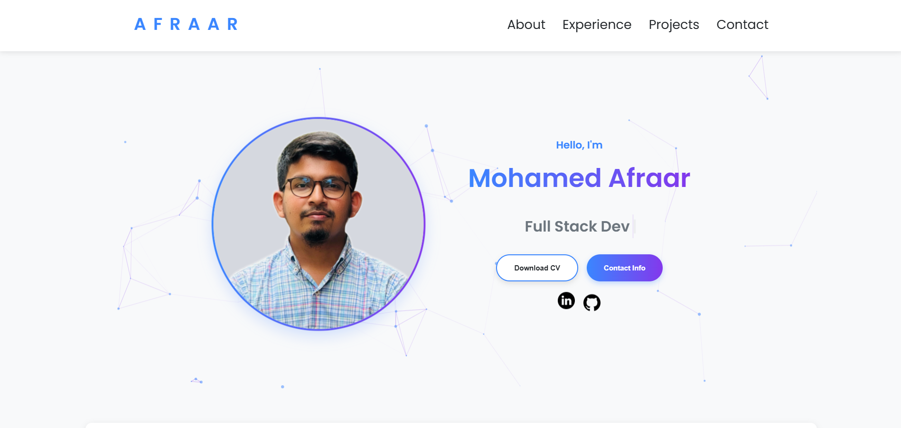

# Personal Portfolio Website



## Overview

This is my personal portfolio website showcasing my skills, projects, education, and experience as a Computing & Information Systems undergraduate and aspiring full-stack developer. The website features a clean, responsive design with interactive elements and animations.

## Features

- **Interactive Particle.js Background** - Dynamic particle animation in the hero section
- **Responsive Design** - Fully responsive layout that works on all devices
- **Animated Elements** - Smooth animations when scrolling through sections
- **Project Showcase** - Highlighted projects with tech stack and links
- **Dynamic Text Animation** - Typewriter effect in the hero section
- **Education & Experience Timeline** - Detailed academic and professional journey
- **Skills & Tools Section** - Visual representation of technical skills
- **Achievements & Volunteering** - Gallery of accomplishments and contributions

## Technologies Used

- **HTML5** - Semantic markup
- **CSS3** - Custom styling with animations and media queries
- **JavaScript** - Interactive elements and animations
- **Particles.js** - Background particle animation
- **Git** - Version control

## Installation & Usage

1. Clone the repository

   ```bash
   git clone https://github.com/Afraar99/Portfolio-Website.git
   ```

2. Navigate to the project directory

   ```bash
   cd Portfolio-Website
   ```

3. Open `index.html` in your browser or use a local development server like Live Server for VS Code.

## Project Structure

```
Portfolio-Website/
├── assets/            # Images and icons
├── index.html         # Main HTML file
├── style.css          # Main stylesheet
├── mediaqueries.css   # Responsive design styles
├── script.js          # JavaScript functionality
├── particles.json     # Particles.js configuration
└── README.md          # Project documentation
```

## Customization

To customize this portfolio for your own use:

1. Update personal information in `index.html`
2. Replace project images and descriptions
3. Update skills, education, and experience sections
4. Modify contact information
5. Customize colors in the CSS variables section of `style.css`

## Future Improvements

- Add dark/light theme toggle
- Implement a blog section
- Add more interactive project demonstrations
- Incorporate a contact form
- Add more animations and effects

## Contact

- LinkedIn: [mohamed-afraar](https://www.linkedin.com/in/mohamed-afraar/)
- GitHub: [Afraar99](https://github.com/Afraar99)

## License

This project is licensed under the MIT License - see the LICENSE file for details.
